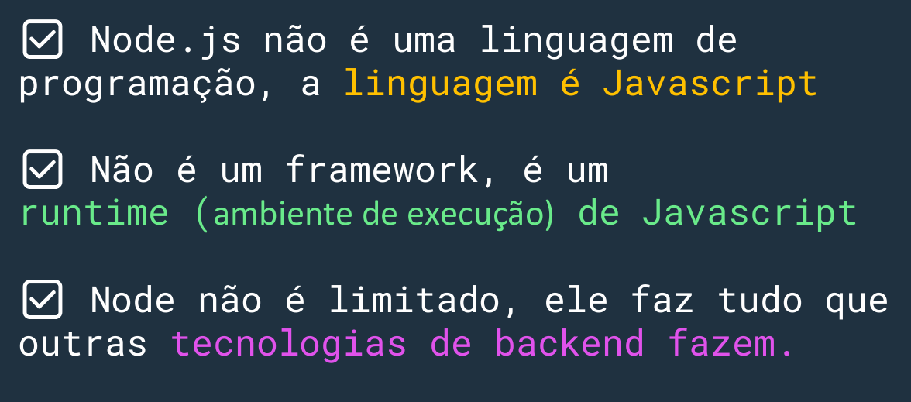
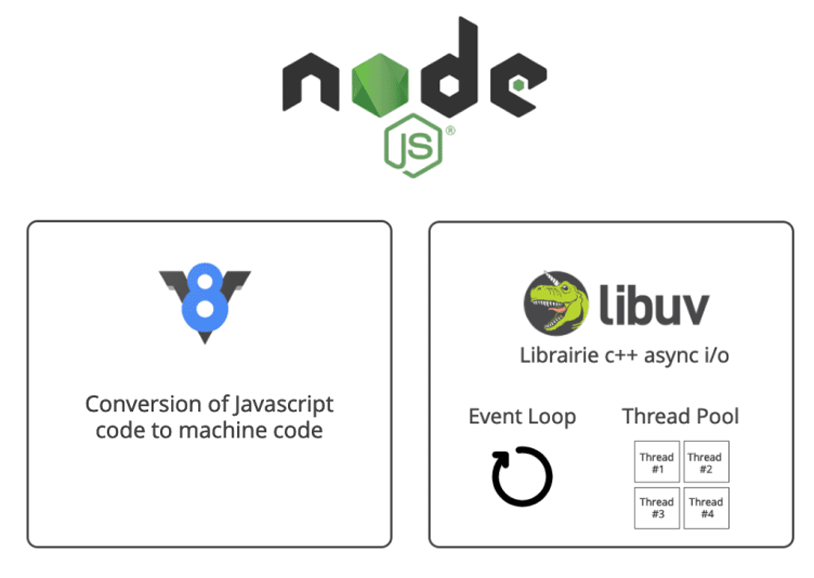
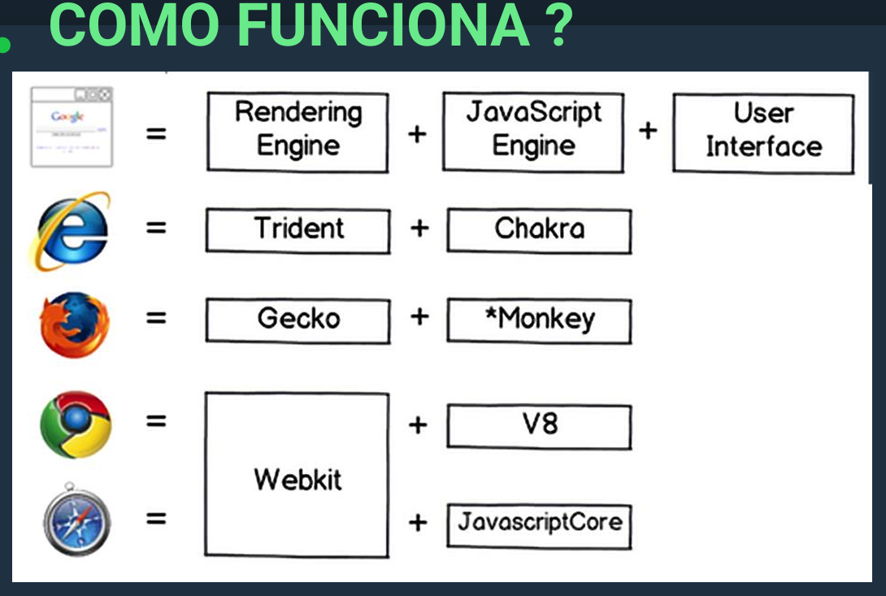
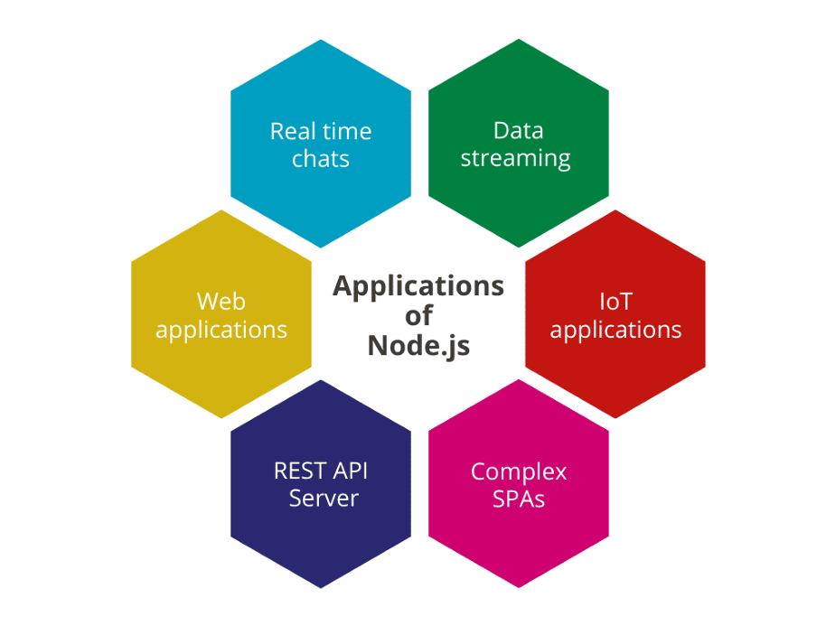
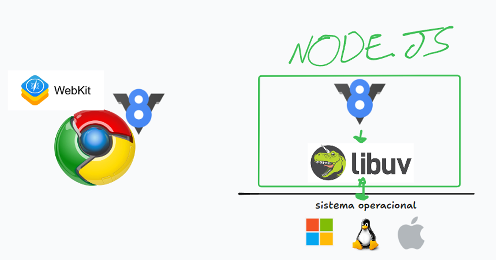

# Node.js: Uma Visão Geral

# 1. Introdução ao Node.js

Node.js é uma plataforma de desenvolvimento que permite executar JavaScript do lado do servidor. Ele não é uma linguagem de programação nem um framework, mas sim um ambiente de execução (runtime) de JavaScript.

## Características principais:

- Flexível e escalável
- Eficiente para desenvolvimento web
- Funciona no backend
- Permite uso de JavaScript tanto no frontend quanto no backend
- Pode ser usado com diversos frameworks
- Multiplataforma (cross-platform)
- Open source

# 2. História do Node.js

- Criado em 2009 por Ryan Dahl
- Lançado como ambiente de execução de JavaScript do lado do servidor
- Versão 0.1.14 lançada em 2010 gratuitamente
- 2013: Versão 0.13 trouxe melhorias de estabilidade
- 2015: Integração com ECMAScript 6
- 2016: Versão 6 introduziu LTS (Long Term Support)
- 2020: Ryan Dahl cria o Deno, principal concorrente do Node.js

## Adoção por grandes empresas:

- Microsoft, Yahoo, LinkedIn, Netflix, GoDaddy, NASA, eBay, Walmart

# 3. Como o Node.js Funciona

O Node.js utiliza o motor JavaScript V8 do Chrome, combinado com uma camada chamada libuv (escrita em C++) que possui um event loop para comunicação com o sistema operacional.

## Componentes principais:

- V8 Engine: Motor JavaScript do Chrome
- libuv: Camada de comunicação com o sistema operacional
    
# 4. Vantagens do Node.js

- Permite que desenvolvedores se tornem full-stack facilmente
- Profissionais se tornam polivalentes
- Fácil de escalar
- Compatibilidade entre versões
- Suporte a aplicações web de página única (SPA - Single Page Applications)

# 5. Considerações Importantes

- Node.js não é limitado; pode fazer tudo que outras tecnologias de backend fazem
- Para ser um desenvolvedor Node.js, é essencial saber JavaScript
- Node.js é mantido pela comunidade através da OpenJS Foundation

# 6. Comparação com Navegadores

Enquanto navegadores possuem rendering engine e JavaScript engine, o Node.js utiliza apenas o JavaScript engine (V8) combinado com o libuv para operações de sistema

