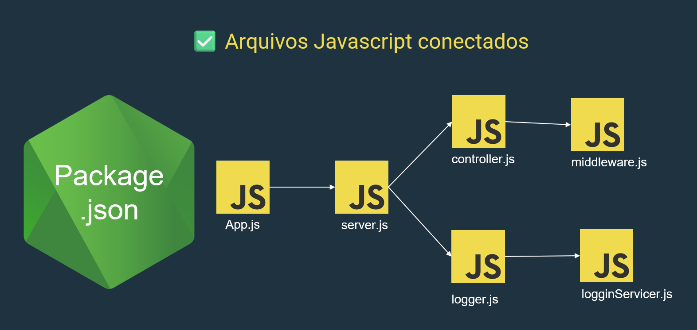
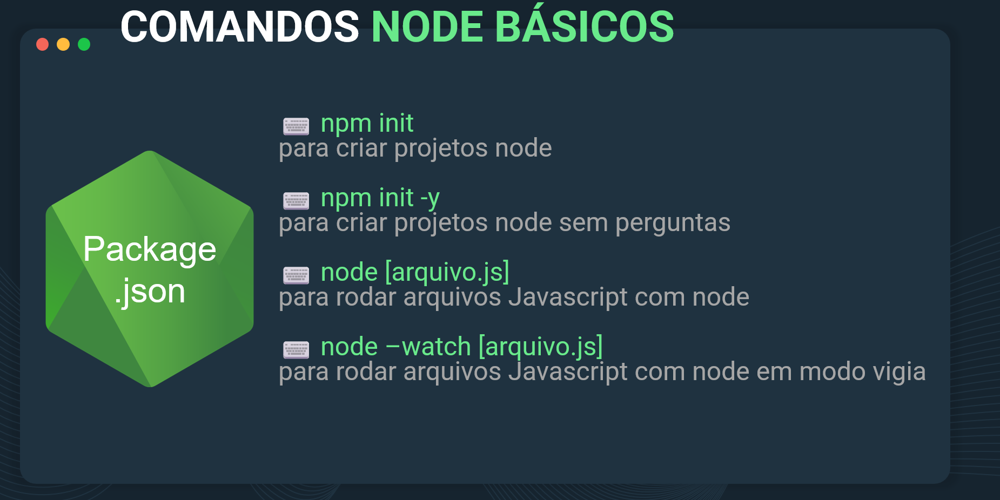
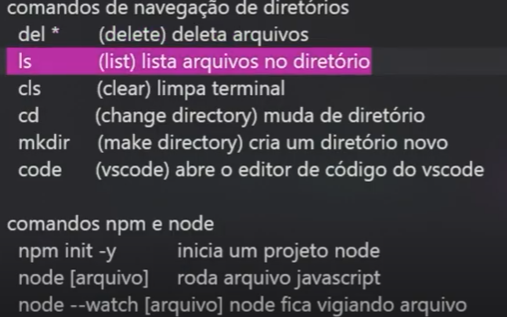

O **NPM** (Node Package Manager) é uma ferramenta essencial no ecossistema **Node.js**. Ele serve como um **gerenciador de pacotes** que facilita a instalação, atualização, e gerenciamento de bibliotecas e módulos JavaScript desenvolvidos por outras pessoas, bem como os que você cria. É uma solução prática para compartilhar e utilizar código de maneira eficiente.

### **O que o NPM faz?**
1. **Gerencia pacotes e bibliotecas**: Permite buscar, instalar e integrar pacotes públicos ou privados na sua aplicação. Os pacotes podem ser ferramentas úteis como frameworks, bibliotecas, ou utilitários de JavaScript.
2. **Gerencia dependências**: Automatiza o controle de versões e compatibilidade dos pacotes usados no projeto.
3. **Executa scripts**: Permite configurar scripts personalizados no arquivo `package.json` para automatizar tarefas como build, testes, e deploy.

---

### **Como funciona?**
Quando o Node.js está instalado no seu sistema, o NPM é incluído automaticamente. Ele permite que você:
- Rode **código JavaScript fora do navegador**, aproveitando o ambiente do Node.js.
- Gerencie projetos de forma organizada com o uso de arquivos de configuração como o `package.json`.

O **arquivo `package.json`** age como o **"coração" do projeto**, conectando todos os arquivos, gerenciando as dependências, as versões, o ponto de entrada da aplicação, e outras informações, como o nome do projeto.

---

### **Iniciando um projeto com NPM**
Para configurar um projeto Node.js com o NPM, existem dois comandos principais:

1. **`npm init`**  
   Inicia a configuração do arquivo `package.json`, solicitando informações como:
   - Nome do projeto.
   - Versão.
   - Descrição.
   - Arquivo de entrada principal (`index.js`, por exemplo).
   - Dependências e outras opções.

2. **`npm init -y`**  
   Configura automaticamente o arquivo `package.json` com valores padrão, economizando tempo, já que você não precisa responder às perguntas manualmente.

---

### **Importante sobre projetos Node.js**
Simplesmente adicionar arquivos `.js` ao projeto **não é suficiente para que ele funcione corretamente** em um ambiente Node.js profissional. O arquivo `package.json` é essencial para:

- Gerenciar as dependências.
- Identificar o ponto de entrada da aplicação.
- Garantir que a estrutura e as versões sejam consistentes ao compartilhar o projeto.

### **Estrutura**

{
  "name": "projeto_dio_node",
  "version": "1.0.0",
  "description": "",
  "main": "index.js",
  "scripts": {
    "test": "echo \"Error: no test specified\" && exit 1"
  },
  "keywords": [],
  "author": "",
  "license": "ISC"
}

